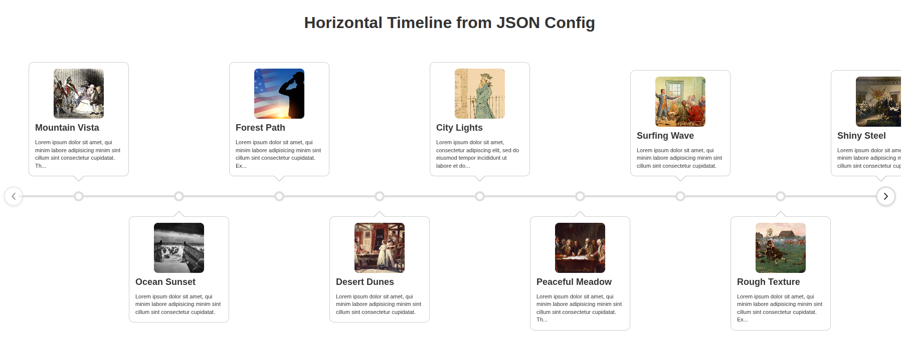

# Vantl - Vanilla Timeline

Vantl is a lightweight, responsive timeline library created with vanilla Javascript for creating beautiful horizontal and vertical timelines with zero dependencies. Inspired by [timeline](https://github.com/squarechip/timeline) originally created by [squarechip](https://github.com/squarechip) in 2018. You can load your timeline data via a variety of methods and, you can include multiple timelines on a single page.

<table align="center">
  <tr>
    <td></td>
  </tr>
</table>

<br/>

## Features

- ✨ **Zero dependencies** - Pure vanilla JavaScript (jQuery optional)
- 📱 **Fully responsive** - Auto-switches between horizontal/vertical layouts
- 🎨 **Customizable colors** - Theme nodes, lines, and navigation
- 🖼️ **Rich content** - Support for images, HTML, and modal popups
- 🔗 **Deep linking** - Link directly to specific timeline nodes via URL
- 📦 **Multiple layouts** - Vertical scroll or horizontal carousel modes
- 💾 **Smart caching** - LocalStorage caching for JSON data
- 🚀 **Auto-init** - Just add a data attribute to load from JSON
- 📏 **Small footprint** - Minified and tree-shakeable

<br/><br/>

# Getting Started:

<br/>

Load stylesheet and Javascript functions to your document via CDN links:

````html
<!DOCTYPE html>
<html>
<head>
  <!-- load stylesheet -->
  <link rel="stylesheet" href="https://cdn.jsdelivr.net/npm/@kendawson-online/vantl@latest/dist/timeline.min.css">
</head>
<body>
   
  <!-- your timeline will go here --> 
  
  <!-- load functions -->
  <script src="https://cdn.jsdelivr.net/npm/@kendawson-online/vantl@latest/dist/timeline.min.js"></script>
</body>
</html>
````
<br/>

### 1️⃣ CREATE A TIMELINE USING BASIC HTML

<br/>

Add some timeline node data in HTML. If you want your timeline to be oriented horizontally, set `data-mode="horizontal"` on the parent element (see code below). If you omit this setting, the timeline will be oriented vertically by default.

````html
<!-- your timeline --> 
<div class="timeline" data-mode="horizontal">
  <div class="timeline__wrap">
    <div class="timeline__items">
        <div class="timeline__item">
            <div class="timeline__content">
                <h5>Jan. 1, 2000</h5>
                <p>Lorem ipsum dolor sit amet, qui minim labore adipisicing minim sint cillum.</p>
            </div>
        </div>
        <div class="timeline__item">
            <div class="timeline__content">
                <h5>Dec. 31, 2000</h5>
                <p>Lorem ipsum dolor sit amet, qui minim labore adipisicing minim sint cillum.</p>
            </div>
        </div>
        <div class="timeline__item">
            <div class="timeline__content">
                <h5>Jan. 1, 2001</h5>
                <p>Lorem ipsum dolor sit amet, qui minim labore adipisicing minim sint cillum.</p>
            </div>
        </div>
    </div>
  </div>
</div>
````
<br/>

Add one line of code at the bottom to initialize your timeline. It goes after the CDN link but before the closing `</body>` tag and looks like this:

````html
  <!-- load functions -->
  <script src="https://cdn.jsdelivr.net/npm/@kendawson-online/vantl@latest/dist/timeline.min.js"></script>

  <!-- initialize the timeline -->
  <script>
    timeline(document.querySelectorAll('.timeline'));
  </script>

</body>
</html>
````

<br/>

### <a href="demo/basic-example.html" target="_blank">View A Basic HTML Example (With Source Code)</a> 👀

<br/><br/>

<a href="https://jquery.com" target="_blank"></a>

Note: if you're using <a href="https://jquery.com" target="_blank">jQuery</a> in your document, you can initialize your timeline like this:

````html
    <!-- load functions -->
    <script src="https://cdn.jsdelivr.net/npm/@kendawson-online/vantl@latest/dist/timeline.min.js"></script>

    <!-- initialize timeline with jQuery -->
    <script>
        jQuery(function () {
            $('.timeline').timeline({
              mode: 'horizontal'
            });
        });
    </script>

  </body>
</html>
````
For more info check the Advanced Usage section below

<br/>

----

<br/>

### 2️⃣ USE DATA ATTRIBUTES TO CUSTOMIZE YOUR TIMELINE

You can add data attributes to the timeline element to control how it looks and/or functions. For example, this is how you would set the orientation of the timeline to be horizontal instead of vertical (default):

```html
<div class="timeline" data-mode="horizontal">
  ...
</div>  
````

If you don't pass an attribute, the app will simply use the default values. 

Here are the available data attributes:

| Option | Type | Default | Description |
|--------|------|---------|-------------|
| `data-mode` | string | `'vertical'` | Layout mode: `'vertical'` or `'horizontal'` |
| `data-min-width` | number | `600` | Minimum viewport width (px) to maintain horizontal mode |
| `data-max-width` | number | `600` | Maximum viewport width (px) to maintain vertical mode |
| `data-move-items` | number | `1` | Items to scroll per navigation click (horizontal) |
| `data-start-index` | number | `0` | Initial item index (horizontal mode) |
| `data-horizontal-start-position` | string | `'top'` | First item alignment in horizontal layout: `'top'` or `'bottom'` |
| `data-vertical-start-position` | string | `'left'` | First item alignment in vertical layout: `'left'` or `'right'` |
| `data-vertical-trigger` | string | `'15%'` | Scroll trigger distance: percentage or px (e.g., `'20%'` or `'150px'`) |
| `data-rtl-mode` | boolean | `false` | Right to left mode: `true` or `false` (only works in horizontal mode and overrides `startIndex` setting) |
| `data-node-color` | string | — | Node circle color (hex/rgb/hsl) |
| `data-line-color` | string | — | Timeline line color (hex/rgb/hsl) |
| `data-nav-color` | string | — | Navigation button color (hex/rgb/hsl) |
| `data-json-config` | string | — | path to a JSON data file (e.g., /path/to/valid/file.json)|

<br/>

See the [API Documentation](API-Documentation.md) for a more detailed description of all options.

<br/>

----

<br/>

### 3️⃣ USING A JSON FILE TO LOAD TIMELINE DATA

<br/>

A great way to use vanilla timeline is to store and load your data from an external [JSON](https://www.json.org) file. JSON stands for: "JavaScript Object Notation". 

It's a lightweight text format stored in a file with a `.json` extension. It's easy for humans to read and write and for machines to parse and use in apps. JSON is based on a web standard so you have to follow the rules to produce "well-formed JSON" that is formatted a specific way. A simple JSON file might look something like this:

````javascript
{
  "timelineName": "Timeline Title",
  "layoutMode": "horizontal",
  "minWidth": 700,
  "maxWidth": "",
  "nodeColor": "",
  "lineColor": "",
  "navColor": ""  
}
````

<br/>

To use JSON, you add a data attribute called `data-json-config` to your HTML to tell the app which JSON file you want to load:

```html
<div class="timeline" data-json-config="/path/to/timeline.json"></div>
```

<br/>

⚠️ **Important:** if you set a `data-json-config` value, the app will prioritize JSON file settings and ignore any other data attribute values being passed inlne via HTML.

If you load your timeline data using the JSON method, you don't have to add the extra line of code at the bottom of the page (used to initialize the timeline). When a JSON file is loaded, the app is initialized automatically. 

Here are some examples of JSON files you can use as templates to build your own timelines:

 - [The most basic and simplified JSON file format possible](demo/assets/data/simple-data-array.json)

 - [A Basic Horizontal Timeline Without Images](demo/assets/data/horiz-no-images.json)

 - [A Basic Vertical Timeline Without Images](demo/assets/data/vert-no-images.json)

 - [Advanced JSON template with Images and Colors](demo/assets/data/blank-template.json)

<br/>

🗓️ **A NOTE ABOUT DATES IN JSON** 🗓️ 

Dates stored in JSON data files (e.g. the `lastupdated` field) are stored in a special format called ISO 8601. The vanilla timeline app expects dates to be in this specific format. 

There is a [demo page](demo/time.html) which displays dates in this format for you. The page also teaches you how to generate ISO 8601 timestamps in the developer console of your own web browser. Open the [demo/time.html](demo/time.html) file in a browser to see a current ISO 8601 timestamp. You can copy/paste this date string directly to your JSON timelines.

----

<br/>

# Deep Linking

Link to a specific timeline node using URL parameters:

```
https://example.com/page.html?timeline=myTimelineId&id=3


https://[domain name]/[page name]?timeline=[timeline ID]&id=[node id]
```
<br/>

1) Add an `id` attribute and value to your timeline container:

````html
    <div id="myTimeline" class="timeline">
       ...
    </div>  
````
<br/>

2) Add a `data-node-id` to each node you want to link to
````html
    <div class="timeline__items">
        <!-- node 1 -->
        <div class="timeline__item">
            <div class="timeline__content">
                <h5>Jan. 1, 2015</h5>
                <p>Lorem ipsum dolor sit amet, qui minim labore.</p>
            </div>
        </div>
        <!-- node 2 -->
        <div class="timeline__item">
            <div class="timeline__content">
                <h5>Dec. 31, 2016</h5>
                <p>Lorem ipsum dolor sit amet, qui minim labore.</p>
            </div>
        </div>
    </div>    
````

Deep linking works automatically with JSON-loaded timelines

<br/>

# Advanced Usage:

### Installing with npm

```bash
npm install @kendawson-online/vantl
```

Importing timeline functions into your Javscript app:

```javascript
import { timeline } from '@kendawson-online/vantl';
import '@kendawson-online/vantl/dist/timeline.min.css';

timeline(document.querySelectorAll('.timeline'), {
  mode: 'vertical',
  nodeColor: '#2d6cdf'
});
```

### Setting options

```javascript
// vanilla Javascript
timeline(document.querySelectorAll('.timeline'), {
  mode: 'horizontal'
});


// jQuery
$('.timeline').timeline({
  mode: 'vertical',
  verticalTrigger: '20%'
});
```

### Available API Options

All options can be set via JavaScript API, data attributes, or with JSON config.

| Option | Type | Default | Description |
|--------|------|---------|-------------|
| `mode` | string | `'vertical'` | Layout mode: `'vertical'` or `'horizontal'` |
| `minWidth` | number | `600` | Min viewport width (px) to maintain horizontal mode |
| `maxWidth` | number | `600` | Max viewport width (px) to maintain vertical mode |
| `moveItems` | number | `1` | Items to scroll per navigation click (horizontal) |
| `startIndex` | number | `0` | Initial item index (horizontal mode) |
| `horizontalStartPosition` | string | `'top'` | First item alignment: `'top'` or `'bottom'` |
| `verticalStartPosition` | string | `'left'` | First item alignment: `'left'` or `'right'` |
| `verticalTrigger` | string | `'15%'` | Scroll trigger distance: percentage or px (e.g., `'20%'` or `'150px'`) |
| `rtlMode` | boolean | `false` | Right-to-left mode (horizontal) |
| `nodeColor` | string | — | Node circle color (hex/rgb/hsl) |
| `lineColor` | string | — | Center line color (hex/rgb/hsl) |
| `navColor` | string | — | Navigation button color (hex/rgb/hsl) |


### Custom Image Path

Override the auto-detected image path:

```html
<script>
  window.TimelineConfig = {
    basePath: '/custom/path/to/images'
  };
</script>
<script src="dist/timeline.min.js"></script>
```

### Programmatic control

```javascript
// Load from JSON programmatically
loadDataFromJson('/data/timeline.json', '#myTimeline');

// Clear cache
clearTimelineCache();             // Clear all
clearTimelineCache('timelineId'); // Clear specific

// Navigate to node (horizontal mode)
navigateTimelineToNodeIndex(containerElement, 5);

// Open modal
openTimelineModal(itemElement);

// Close modal
closeTimelineModal();
```

### More Information

 - [API Documentation](API-Documentation.md)
 - [Development Documentation](Development.md)

## Browser Support

- Chrome/Edge (2018+)
- Firefox (2018+)  
- Safari (2018+)
- Requires: ES6, IntersectionObserver, CSS Custom Properties

## Contributing

See [Development.md](Development.md) for build instructions and an architectural overview. 

See [API Documentation](API-Documentation.md) for details about how the API works.

You can report issues and open pull requests on GitHub:

- https://github.com/kendawson-online/vantl/issues

- https://github.com/kendawson-online/vantl/pulls

## Links

**NPM Package:** [@kendawson-online/vantl](https://www.npmjs.com/package/@kendawson-online/vantl)  

**Repository:** [github.com/kendawson-online/vantl](https://github.com/kendawson-online/vantl)  

**CDN:** [cdn.jsdelivr.net/npm/@kendawson-online/vantl](https://cdn.jsdelivr.net/npm/@kendawson-online/vantl)


## License

[MIT License](LICENSE)

---

**Note (optional Swiper integration):**

You may see a Rollup warning during `npm run build` similar to:

```
(!) Unresolved dependencies
swiper (imported by "src/adapters/swiper-adapter.js")
```

This is expected when Swiper is optional (not installed) because the adapter attempts to load Swiper at runtime via an ESM CDN, dynamic import, or `window.Swiper` (UMD). The build still completes; if you want Rollup to stop warning, add `external: ['swiper']` to `rollup.config.js`, or install `swiper` locally to include it in the bundle.


## Credits

Originally inspired by [timeline](https://github.com/squarechip/timeline) by [Mike Collins](https://github.com/squarechip) (2018).

Refactored and maintained by [Ken Dawson](https://github.com/kendawson-online) (2026).

